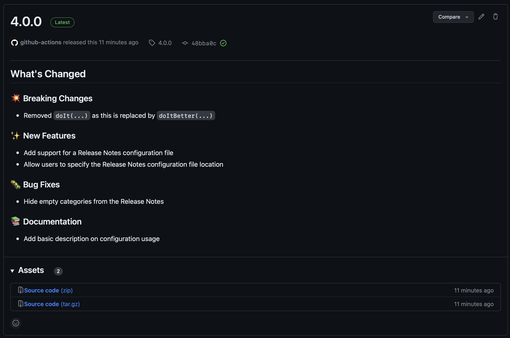

<!--
SPDX-FileCopyrightText: 2023 Kevin de Jong <monkaii@hotmail.com>
SPDX-License-Identifier: MIT
-->

# ReleaseMe - GitHub Release Management

A GitHub Action to automate release management using GitHub Releases;



## Features

- [Creation of GitHub Releases](#basic-usage) with automatic version increments:
  - [Semantic Versioning](./docs/versioning-strategies.md#semantic-versioning) with [Conventional Commits]
  - [Calendar Versioning](./docs/versioning-strategies.md#calendar-versioning) using `YYYY.0M.MICRO` format.
- Straightforward release branching support
- Management of [GitHub Release assets](./docs/asset-management.md)
- [Configurable changelog](./docs/configuration.md)
- [Accessing GitHub Release information](./docs/get-release.md)

## Basic Usage

```yaml
name: GitHub Release

concurrency: deployment

on:
  push:
    branches:
      - main
      - release/*

permissions:
  contents: write

jobs:
  release-me:
    name: Create GitHub Release
    runs-on: ubuntu-latest
    steps:
      - name: Run ReleaseMe
        id: release
        uses: dev-build-deploy/release-me@v0
        with:
          token: ${{ github.token }}
          prefix: v                    # OPTIONAL; prefixes the version with v (e.g. v1.0.0)
          config: .github/release.yml  # OPTIONAL; path to a Release configuration
          versioning: semver           # OPTIONAL; either `semver` or `calver`
          files: |                     # OPTIONAL; multiline list of local files names to upload as GitHub Release assets
            build.log
            dependencies.json
          artifacts: |                 # OPTIONAL; multiline list of build artifacts to upload as GitHub Release assets
            SBOM

      - if: ${{ steps.release.outputs.created }}
        run: echo ${{ fromJSON(steps.release.outputs.release).tag_name }}
```

## Inputs

| Key | Required | Description |
| --- | --- | --- |
| `token` | YES | GitHub token used to access GitHub |
| `prefix` | NO | Prefix for the version, MUST be one of `[A-Za-z0-9-.]` |
| `config`  | NO | Path to the [Release configuration](./docs/configuration.md), defaults to `.github/release.yml` | 
| `artifacts` | NO | Multiline list of artifact names, uploaded as part of the current workflow run, to upload as a [GitHub Release asset](./docs/asset-management.md) |
| `create-release` | NO | Create the GitHub Release, can be set to `false` to perform a dry run (i.e. determine the previous and incremented version), defaults to `true`. |
| `draft` | NO | Create a GitHub Release in `draft` status, defaults to `false` |
| `files` | NO | Multiline list of files (paths) to upload as a [GitHub Release asset](./docs/asset-management.md) |
| `increment-type` | NO | Enforce a specific increment type, please refer to the [Versioning Strategies](./docs/versioning-strategies.md) for more details |
| `release-notes` | NO | Path towards a file containing the release notes to include in the GitHub release (Markdown format recommended) |
| `version` | NO | Version to associate with the GitHub Release, can be OPTIONALLY set to override automatic detection or the `increment-type` parameter |
| `versioning` | NO | [Versioning strategy](#versioning-strategies) to apply. MUST be one of `semver` or `calver`. Default: `semver` |

## Outputs

| Key | Description |
| --- | --- |
| `created` | Set to `true` when a release was created, otherwise the output is not set |
| `release` | [Release object](./src/release.ts) containing relevant information about the created release. Only set when `created` is set to `true`. |
| `previous-version` | The version of the GitHub Release prior to the current state |
| `incremented-version` | The incremented version as used for the GitHub Release |

## Permissions

| Permission | Value | Description |
| --- | --- | --- |
| `contents` | `write` | Required to create new GitHub Releases (and push tags) |

## Contributing

If you have suggestions for how release-me could be improved, or want to report a bug, open an issue! We'd love all and any contributions.

For more, check out the [Contributing Guide](CONTRIBUTING.md).

## License

- [MIT](./LICENSES/MIT.txt) © 2023 Kevin de Jong \<monkaii@hotmail.com\>

[SemVer]: https://semver.org
[Conventional Commits]: https://www.conventionalcommits.org/en/v1.0.0/
