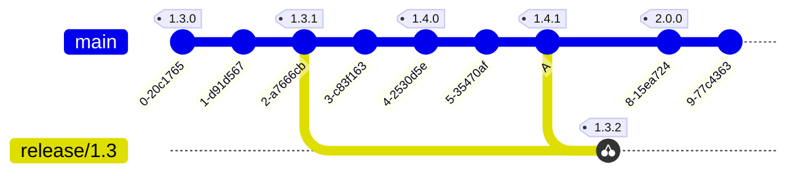
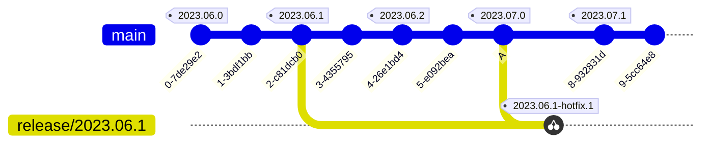

<!--
SPDX-FileCopyrightText: 2023 Kevin de Jong <monkaii@hotmail.com>

SPDX-License-Identifier: GPL-3.0-or-later
-->

# ReleaseMe - GitHub Release Management

A GitHub Action to automate versioning using create GitHub Releases;


## Features

- Simple to use
- Automatic creation of GitHub Releases
- Supports [Semantic- and Calendar- Versioning](#versioning-strategies)
- Straightforward release branching support
- Management of [GitHub Release assets](#uploading-assets)
- [Configurable changelog](#github-release-configuration)


## Usage

```yaml
name: GitHub Release

concurrency: deployment

on:
  push:
    branches:
      - main

permissions:
  contents: write

jobs:
  release-me:
    name: Create GitHub Release
    runs-on: ubuntu-latest
    steps:
      - name: Run ReleaseMe
        id: release
        uses: dev-build-deploy/release-me@v0
        with:
          token: ${{ github.token }}
          prefix: v  # OPTIONAL; prefixes the version with v (e.g. v1.0.0)
          config: .github/release.yml # OPTIONAL; path to a Release configuration
          versioning: semver # OPTIONAL; either `semver` or `calver`

      - if: ${{ steps.release.outputs.created }}
        run: echo ${{ fromJSON(steps.release.outputs.release).tag_name }}
```

## Uploading assets
ReleaseMe allows you to upload assets from both build artifacts (`artifacts:`) and local files (`files:`).

```yaml
# Create an example file
- run: echo "Example" > output.txt

# Upload the output file as a build artifact
- uses: actions/upload-artifact@v3
  with:
    name: output-as-artifact
    path: output.txt

# Create a GitHub Release with both the direct output file
# and build artifact as asset
- name: Run ReleaseMe
  uses: dev-build-deploy/release-me@v0
  with:
    token: ${{ github.token }}
    artifacts: output-as-artifact
    files: output.txt
```

## GitHub Release Configuration

You can configure the body of the GitHub Release by using a configuration file (loosely based on [Automatically generated release notes](https://docs.github.com/en/repositories/releasing-projects-on-github/automatically-generated-release-notes));

```yaml
changelog:
  exclude:
    scopes:
      - deps
  categories:
    - title: "💥 Breaking Changes"
      increment: ["MAJOR"]
    - title: "✨ New Features"
      increment: ["MINOR"]
    - title: "🐛 Bug Fixes"
      increment: ["PATCH"]
      exclude:
        scopes: ["internal"]
    - title: "📚 Documentation"
      types: ["docs"]
      scopes: ["api"]
```

| Key | Description |
| --- | --- |
| `changelog.categories[*].title` | Title to use in the generated Release Notes |
| `changelog.categories[*].increment` | List of increment types (see [Versioning stratgiees](#versioning-strategies) for an overview) to include in this category |
| `changelog.categories[*].types` | List of [Conventional Commits] types to include in this category |
| `changelog.categories[*].scopes` | List of [Conventional Commits] scopes to include in this category |
| `changelog[.categories[*]].exclude.increment` |List of increment types (see [Versioning stratgiees](#versioning-strategies) for an overview) to exclude in this category |
| `changelog[.categories[*]].exclude.types` | List of [Conventional Commits] types to exclude from the Release Notes
| `changelog[.categories[*]].exclude.scopes` | List of [Conventional Commits] scopes to exclude from the Release Notes |

> **NOTE**: You can use the wildcard `*` to specify all values for a specific category. This value is automatically set if a inclusion pattern is not set in the configuration file.

## Versioning Strategies

The following versioning strategies are currently supported:

- (Default) [Semantic Versioning](#semantic-versioning)
- [Calendar Versioning](#calendar-versioning)

### Semantic Versioning

ReleaseMe uses a subset of Semantic Versioning based on Conventional Commits;

`MAJOR.MINOR.PATCH`

| Item | Description |
| --- | --- |
| `MAJOR` | Breaking change to the (public) API |
| `MINOR` | New feature added in a backwards compatible manner |
| `PATCH` | Backwards compatible bug fix |

The version is incremented based on Conventional Commits.

You can mark your changes as "BREAKING" by either adding a `!` indicator after you Conventional Commit type:

```
feat!: breaking API change
```

or by adding `BREAKING-CHANGE` to the footer of your commit message:

```
feat: introducing new feature X

This commit introduces feature X, which required a large
redesign of the core functionality. We have decided to
drop support of the original API (`DoIt(...`) as this would
have a significant impact on the maintenance burden of our
application.

BREAKING-CHANGE: removes the `DoIt(...)` method in favor of `DoItBetter(...)`
```

In addition, on the *default branch*, the Conventional Commit type is taken into account according to specification;

| Type | Current Version | Incremented Version |
| --- | --- | --- |
| Breaking change | `0.1.2` | `1.0.0` |
| `feat` | `1.0.0` | `1.1.0` |
| `fix` | `1.1.0` | `1.1.1` |
| Anything else | `1.1.1` | - |

Any other Conventional Commit type will, unless breaking, **not** increment the version.

Any changes made to a *release branch* (`release/<MAJOR>.<MINOR>`) will **at most** increment `PATCH`:

| Type | Current Version | Incremented Version |
| --- | --- | --- |
| Breaking change | `0.1.2` | `0.1.3` |
| `feat` | `0.1.3` | `0.1.4` |
| `fix` | `0.1.4` | `0.1.5` |
| Anything else | `0.1.5` | - |

<details>
<summary>Example...</summary>



</details>


### Calendar Versioning

You can use Calendar Versioning for your releases, using the following predefined [CalVer] format:

`YYYY.0M.MICRO[-MODIFIER]`

| Item | Description |
| --- | --- |
| `YYYY` | Full year |
| `0M` | Zero padded month number |
| `MICRO` | Incremental release number |
| `MODIFIER` | Reserved for incremental releases on a [release branch](#branching-strategy). Will use a value in the range `hotfix.[n]` |

Every single change made to your *default branch* will result in:
- an increment of the `CALENDAR` type:
- an increment of the `MICRO` type in case the calendar date did not change

For example:

| Current date | Current Version | Incremented Version |
| --- | --- | --- |
| 21 Jun 2023 | `2023.06.0` | `2023.06.1` |
| 28 Jun 2023 | `2023.06.1` | `2023.06.2` |
| 6 Jul 2023 | `2023.06.2` | `2023.07.0` |

> :bulb: More details can be found [here](https://github.com/dev-build-deploy/version-it#incrementing-the-version-1)

Any change made to a *release branch* (`release/<YYYY>.<0M>.<MICRO>`), will increase the `MODIFIER`:

| Current date | Current Version | Incremented Version |
| --- | --- | --- |
| 21 Jun 2023 | `2023.06.0` | `2023.06.0-hotfix.1` |
| 28 Sep 2023 | `2023.06.0-hotfix.1` | `2023.06.0-hotfix.2` |
| 6 Dec 2023 | `2023.06.0-hotifx.2` | `2023.06.0-hotfix.3` |

<details>
<summary>Example...</summary>



</details>

## Inputs

| Key | Required | Description |
| --- | --- | --- |
| `token` | YES | GitHub token used to access GitHub |
| `prefix` | NO | Prefix for the version, MUST be one of `[A-Za-z0-9-.]` |
| `config`  | NO | Path to the Release configuration, defaults to `.github/release.yml` | 
| `artifacts` | NO | Multiline list of artifact names, uploaded as part of the current workflow run, to upload as a GitHub Release asset |
| `files` | NO | Multiline list of files (paths) to upload as a GitHub Release asset |
| `versioning` | NO | [Versioning strategy](#versioning-strategies) to apply. MUST be one of `semver` or `calver`. Default: `semver`

## Outputs

| Key | Description |
| --- | --- |
| `created` | Set to `true` when a release was created, otherwise the output is not set |
| `release` | [Release object](./src/release.ts) containing relevant information about the created release. Only set when `created` is set to `true`.|

## Permissions

| Permission | Value | Description |
| --- | --- | --- |
| `contents` | `write` | Required to create new GitHub Releases (and push tags) |

## Contributing

If you have suggestions for how release-me could be improved, or want to report a bug, open an issue! We'd love all and any contributions.

For more, check out the [Contributing Guide](CONTRIBUTING.md).

## License

- [GPL-3.0-or-later AND CC0-1.0](LICENSE) © 2023 Kevin de Jong \<monkaii@hotmail.com\>

[SemVer]: https://semver.org
[Conventional Commits]: https://www.conventionalcommits.org/en/v1.0.0/
