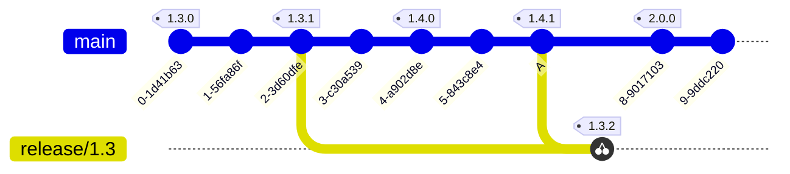
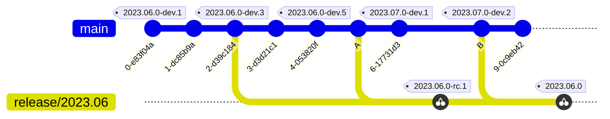

<!--
SPDX-FileCopyrightText: 2023 Kevin de Jong <monkaii@hotmail.com>
SPDX-License-Identifier: MIT
-->

# Versioning Strategies

The following versioning strategies are currently supported:

- (Default) [Semantic Versioning](#semantic-versioning)
- [Calendar Versioning](#calendar-versioning)

## Semantic Versioning

ReleaseMe uses a subset of Semantic Versioning based on Conventional Commits;

`MAJOR.MINOR.PATCH`

| Item | Description |
| --- | --- |
| `MAJOR` | Breaking change to the (public) API |
| `MINOR` | New feature added in a backwards compatible manner |
| `PATCH` | Backwards compatible bug fix |

The version is incremented based on Conventional Commits.

You can mark your changes as "BREAKING" by either adding a `!` indicator after you Conventional Commit type:

```
feat!: breaking API change
```

or by adding `BREAKING-CHANGE` to the footer of your commit message:

```
feat: introducing new feature X

This commit introduces feature X, which required a large
redesign of the core functionality. We have decided to
drop support of the original API (`DoIt(...`) as this would
have a significant impact on the maintenance burden of our
application.

BREAKING-CHANGE: removes the `DoIt(...)` method in favor of `DoItBetter(...)`
```

In addition, on the *default branch*, the Conventional Commit type is taken into account according to specification;

| Type | Current Version | Incremented Version |
| --- | --- | --- |
| Breaking change | `0.1.2` | `1.0.0` |
| `feat` | `1.0.0` | `1.1.0` |
| `fix` | `1.1.0` | `1.1.1` |
| Anything else | `1.1.1` | - |

Any other Conventional Commit type will, unless breaking, **not** increment the version.

Any changes made to a *release branch* (`release/<MAJOR>.<MINOR>`) will **at most** increment `PATCH`:

| Type | Current Version | Incremented Version |
| --- | --- | --- |
| Breaking change | `0.1.2` | `0.1.3` |
| `feat` | `0.1.3` | `0.1.4` |
| `fix` | `0.1.4` | `0.1.5` |
| Anything else | `0.1.5` | - |

<details>
<summary>Example...</summary>



</details>


## Calendar Versioning

You can use Calendar Versioning for your releases, using the following predefined [CalVer] format:

`YYYY.0M.MICRO[-MODIFIER]`

| Item | Description |
| --- | --- |
| `YYYY` | Full year |
| `0M` | Zero padded month number |
| `MICRO` | Incremental release number |
| `MODIFIER` | Used to denote a Development build (`-dev.[n]`) or Release Candidate (`-rc.[n]`) |

Every single change made to either you _default_ and _release_ branches will have its `CALENDAR` version incremented;

For example:

| Branch | Current date | Current Version | Incremented Version |
| --- | --- | --- | --- |
| Default | 21 Jun 2023 | `2023.06.0-dev.1` | `2023.06.0-dev.2` |
| Default | 6 Jul 2023 | `2023.06.0-dev.2` | `2023.07.0-dev.1` |
| Release | 6 Jul 2023 | `2023.07.0-dev.1` | `2023.07.0-rc.1` |

> [!INFO]
> More details can be found [here](https://github.com/dev-build-deploy/version-it#incrementing-the-version-1)

You will need to set the `increment-type` input-parameter to `MICRO` in order to release the version:

| Current date | Current Version | Incremented Version |
| --- | --- | --- |
| 21 Jun 2023 | `2023.06.0-rc.4` | `2023.06.1` |
| 28 Sep 2023 | `2023.06.1` | `2023.06.2` |
| 6 Dec 2023 | `2023.06.2` | `2023.06.3` |

<details>
<summary>Example...</summary>



</details>
